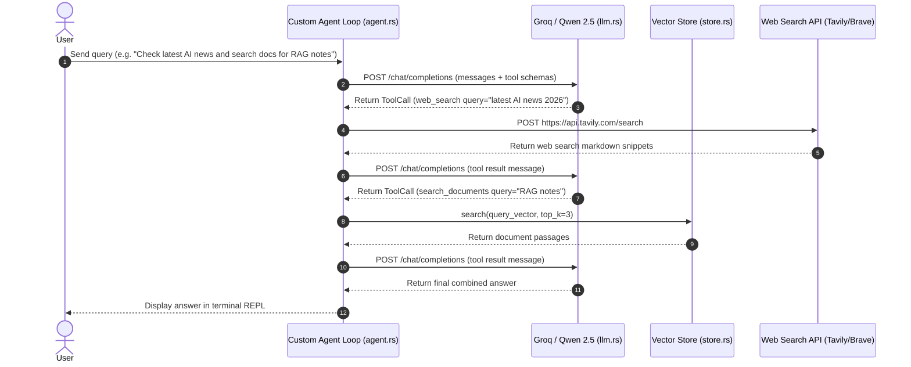

# Rust Agent Architecture & Design Specification

## 1. Overview & Core Philosophy

`rust-rag-agent` is a lightweight, high-performance, single-binary Autonomous AI Agent built in Rust.

### Core Architectural Principles
- **100% Single Binary Constraint**: Zero Docker containers, PostgreSQL, or external database daemons required.
- **Custom Agent Loop (No `rig-core`)**: Uses a custom-built async agent loop in `src/agent.rs` for 100% fine-grained control, zero framework bloat, and fast iteration.
- **No MCP Servers Needed**: Operates without IPC/stdio MCP server subprocesses. All tools (web search, document retrieval, file system, API integrations) are declared as native Rust functions (`ToolDef` schemas in `src/llm.rs`) or called via direct REST APIs (`reqwest`).
- **Qwen 2.5 Recommended Engine**: Default model set to `llama-3.3-70b-versatile` or `llama-3.3-70b-versatile` on Groq for top-tier function calling precision.
- **In-Process Vector Store & Cache**: Fast cosine similarity vector search in CPU memory with binary disk persistence (`.vector_cache.bin`).

```
                      +-------------------+
                      |   User (Terminal) |
                      +---------+---------+
                                | Query
                                v
                      +---------+---------+
                      |   Agent REPL      |
                      |   (src/main.rs)   |
                      +---------+---------+
                                |
             +------------------+------------------+
             |                                     |
             v                                     v
  +----------+----------+               +----------+----------+
  | Local Document Store|               |  LLM Provider       |
  |  (src/store.rs)     |               |  (src/llm.rs)       |
  +----------+----------+               +----------+----------+
  | Multi-Format Loader |               | Groq Cloud API      |
  | (.txt, .md, .pdf,   |               | (Qwen 2.5 Coder 32B)|
  |  .csv, .json)       |               +---------------------+
  | Text Chunker (400w) |                          |
  | Vector Cache (.bin) |                          v
  +----------+----------+               +---------------------+
             |                          | Web Search API      |
             | Vectors                  | (Tavily / Brave)    |
             v                          +---------------------+
  +----------+----------+                          |
  | FastEmbed ONNX Model|                          v
  | (src/embeddings.rs) |               +---------------------+
  +---------------------+               | Cloud Integrations  |
                                        | (Composio / GitHub) |
                                        +---------------------+
```

---

## 2. Tool-Calling Architecture & Tool Suite

### Native Tool Definitions (`src/llm.rs`)
1. **`list_documents`**: Returns the array of ingested filenames in `DocStore` (prevents vector search hallucinations when users ask for file metadata).
2. **`search_documents`**: RAG vector similarity search over chunked document passages (`maxLength: 120` query constraint).
3. **`web_search`**: Live internet queries via Tavily API or Brave Search API.
4. **`list_dir` / `read_file` / `write_file`**: Direct local file system inspection and modifications.
5. **`run_command`**: Sandboxed terminal command execution.
6. **Composio REST Tools**: Authenticated third-party API execution (Gmail, GitHub, Slack) via direct REST calls.

---

## 3. Multi-Format Ingestion & Chunking Pipeline

### Multi-Format Extraction
- **`.txt` / `.md`**: Loaded via standard UTF-8 file readers (`pulldown-cmark` for Markdown parsing).
- **`.pdf`**: Text extracted page-by-page using `pdf-extract`.
- **`.csv`**: Tabular rows transformed into human-readable key-value strings (`Header1: Value1 | Header2: Value2`) via `csv` crate.
- **`.json`**: Structured objects converted to formatted context strings.

### Sliding-Window Text Chunker
1. Long documents are split into **300–400 word passages**.
2. A **50-word sliding overlap** is maintained between adjacent passages to prevent context loss across boundaries.

---

## 4. Execution Flow Diagram


