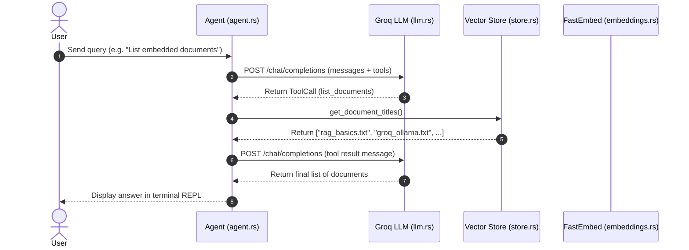

# Rust RAG Agent Architecture & Design Specification

## 1. Overview & Core Philosophy

`rust-rag-agent` is a lightweight, high-performance Agentic RAG system built in Rust. 

### Core Architectural Principles
- **100% Single Binary Constraint**: Zero Docker containers, PostgreSQL, or external vector database servers required.
- **Embedded Local AI Engine**: Runs local vector embeddings on CPU via `fastembed` (ONNX Runtime, BGE-small-en model).
- **Qwen 2.5 Function Calling**: Default model updated to `qwen-2.5-coder-32b` or `qwen-2.5-72b-instruct` on Groq to eliminate Llama 3.3 raw tag syntax corruptions (`<function=...`) and tool over-triggering.
- **In-Process Vector Store & Cache**: Fast cosine similarity vector search in CPU memory with binary disk persistence (`.vector_cache.bin`).

```
                      +-------------------+
                      |   User (Terminal) |
                      +---------+---------+
                                | Query
                                v
                      +---------+---------+
                      |   Agent REPL      |
                      |   (src/main.rs)   |
                      +---------+---------+
                                |
             +------------------+------------------+
             |                                     |
             v                                     v
  +----------+----------+               +----------+----------+
  | Local Document Store|               |  LLM Provider       |
  |  (src/store.rs)     |               |  (src/llm.rs)       |
  +----------+----------+               +----------+----------+
  | Multi-Format Loader |               | Groq Cloud API      |
  | (.txt, .md, .pdf,   |               | (Qwen 2.5 Coder 32B)|
  |  .csv, .json)       |               +---------------------+
  | Text Chunker (400w) |                          |
  | Vector Cache (.bin) |                          v
  +----------+----------+               +---------------------+
             |                          | Web Search API      |
             | Vectors                  | (Tavily / Brave)    |
             v                          +---------------------+
  +----------+----------+
  | FastEmbed ONNX Model|
  | (src/embeddings.rs) |
  +---------------------+
```

---

## 2. Tool-Calling Architecture & Syntax Protection

### Dedicated Tool Definitions
To prevent model hallucinations and vector search misuse:
1. `search_documents(query)`: RAG vector search over indexed document passages.
   - Enforces `maxLength: 120` on queries to prevent runaway string generation loops.
2. `list_documents()`: Returns the full array of ingested filenames in `DocStore`.

### Clean System Prompt Rule
The system prompt in `agent.rs` avoids manual text descriptions of tool syntax (`<function=...`). This prevents double-prompting conflict with Groq's API engine and ensures clean native JSON payload generation.

---

## 3. Multi-Format Ingestion & Chunking Pipeline

### Multi-Format Extraction
- **`.txt` / `.md`**: Loaded via standard UTF-8 file readers (`pulldown-cmark` for Markdown parsing).
- **`.pdf`**: Text extracted page-by-page using `pdf-extract`.
- **`.csv`**: Tabular rows transformed into human-readable key-value strings (`Header1: Value1 | Header2: Value2`) via `csv` crate.
- **`.json`**: Structured objects converted to formatted context strings.

### Sliding-Window Text Chunker
1. Long documents are split into **300–400 word passages**.
2. A **50-word sliding overlap** is maintained between adjacent passages to prevent context loss across boundaries.

---

## 4. Execution Flow Diagram


